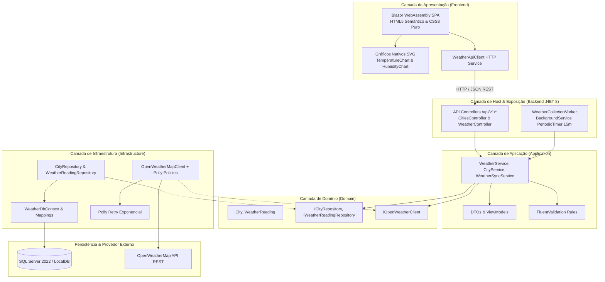
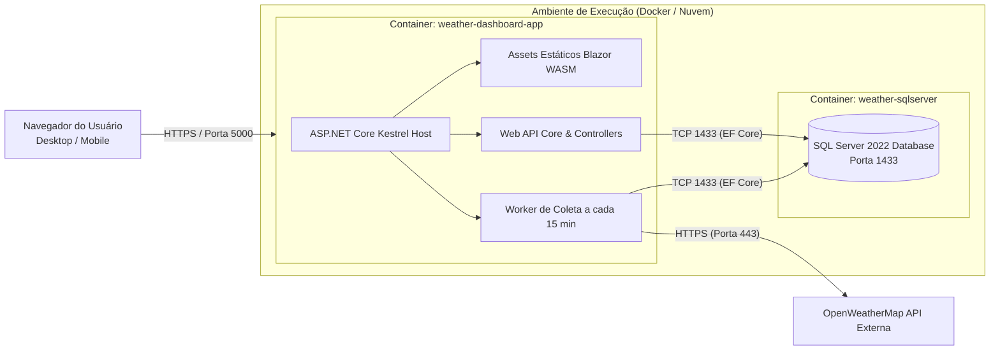

# Dashboard Climático das Capitais Brasileiras

Sistema completo e profissional (.NET 8 C#) para monitoramento, histórico e consolidação de indicadores meteorológicos das **27 capitais brasileiras**, com backend em **ASP.NET Core Web API**, persistência relacional com **Entity Framework Core 8 + SQL Server**, worker em segundo plano para coleta resiliente a cada 15 minutos com **Polly**, e frontend moderno e acessível em **Blazor WebAssembly** com **gráficos vetoriais SVG nativos**, HTML5 semântico e CSS3 puro (sem bibliotecas externas pesadas).

---

## Sumário
- [1. Decisões de Design e Suposições](#1-decisões-de-design-e-suposições)
- [2. Stack Tecnológica](#2-stack-tecnológica)
- [3. Diagramas de Arquitetura](#3-diagramas-de-arquitetura)
  - [3.1 Arquitetura Lógica](#31-arquitetura-lógica)
  - [3.2 Arquitetura Física e Infraestrutura](#32-arquitetura-física-e-infraestrutura)
- [4. Funcionalidades do Sistema](#4-funcionalidades-do-sistema)
- [5. Como Executar o Projeto](#5-como-executar-o-projeto)
  - [5.1 Execução Rápida em 1 Clique](#51-execução-rápida-em-1-clique)
  - [5.2 Execução Manual (.NET CLI)](#52-execução-manual-net-cli)
  - [5.3 Execução com Docker Compose](#53-execução-com-docker-compose)
  - [5.4 Execução dos Testes Automatizados](#54-execução-dos-testes-automatizados)
- [6. Estrutura de Diretórios](#6-estrutura-de-diretórios)
- [7. Wiki Oficial do Projeto](#7-wiki-oficial-do-projeto)

---

## 1. Decisões de Design e Suposições

| Ponto do Enunciado | Decisão Adotada | Justificativa |
|---|---|---|
| **Banco de Dados** | **SQL Server** oficial com fallback automático **InMemory** e seed das 27 capitais. | Persistência relacional robusta com índices compostos `(CityId, CollectedAtUtc)` e garantia de execução *out-of-the-box* em qualquer ambiente. |
| **Frontend** | **Blazor WebAssembly** com **HTML5 semântico**, **CSS3 puro** e **gráficos SVG nativos**. | Elimina dependência de templates pesados de terceiros, garantindo máxima performance, controle visual e acessibilidade (a11y). |
| **Arquitetura** | **Clean Architecture** (Domain, Application, Infrastructure, Api, Web). | Separação estrita de responsabilidades, testabilidade independente de banco ou rede, facilidade de manutenção e evolução. |
| **Coleta Periódica** | **BackgroundService** (`PeriodicTimer`) executando a cada 15 minutos para todas as 27 capitais. | Garante que o banco mantenha o histórico sempre atualizado para qualquer capital selecionada. |
| **Resiliência e Tolerância a Falhas** | **Polly** (Retry exponencial) e isolamento por capital. | Uma eventual falha ou timeout em uma cidade não interrompe a coleta das demais 26 capitais. |
| **Transparência de Provedor** | Telemetria de conexão em tempo real e painel de diagnóstico da OpenWeatherMap. | Transparência total sobre o status HTTP do provedor externo sem geração silenciosa de dados fictícios. |

---

## 2. Stack Tecnológica

- **Linguagem & Runtime:** .NET 8 (LTS) / C# 12
- **Backend:** ASP.NET Core Web API RESTful (`/api/v1/*`), Swagger / OpenAPI
- **Persistência:** Entity Framework Core 8, Microsoft SQL Server 2022 / LocalDB / InMemory fallback
- **Frontend:** Blazor WebAssembly 8, HTML5 Semântico, CSS3 Grid/Flexbox puro, SVG inline nativo
- **Resiliência de Rede:** HttpClientFactory + Polly (Retry com Backoff exponencial)
- **Logs Estruturados:** Serilog (Console + Arquivo diário rotativo)
- **Testes Automatizados:** xUnit, FluentAssertions, Moq, Microsoft.AspNetCore.Mvc.Testing, bUnit (19 testes)
- **Containerização:** Docker (Multistage build) & Docker Compose

---

## 3. Diagramas de Arquitetura

### 3.1 Arquitetura Lógica




### 3.2 Arquitetura Física e Infraestrutura




---

## 4. Funcionalidades do Sistema

- **Seletor de Capitais:** Todas as 27 capitais brasileiras cadastradas com coordenadas oficiais e agrupamento geográfico por região (`<optgroup>`).
- **Panorama Nacional:** Card de destaque com a capital mais quente, a capital mais fria e as médias térmicas/umidade do Brasil.
- **Card Hero do Clima Atual:** Temperatura, sensação térmica, umidade, vento, pressão e ícone meteorológico oficial.
- **Estatísticas do Dia Atual:** Temperatura máxima, mínima, média ponderada, sensação térmica média, umidade média, velocidade média do vento, pressão e total de amostras persistidas.
- **Gráfico 1 — Histórico Térmico (Puro SVG):** Curva de temperatura real (°C), linha pontilhada de sensação térmica, gradiente de área e tooltips nativos.
- **Gráfico 2 — Umidade e Vento (Puro SVG):** Curva de umidade relativa (%) com área sombreada e linha de velocidade do vento (m/s).
- **Filtros de Período:** Atalhos rápidos para *Hoje*, *Últimas 24 Horas*, *Últimos 7 Dias*, *Últimos 30 Dias* e *Intervalo Personalizado*.
- **Exportação CSV:** Download imediato da série temporal filtrada em formato CSV UTF-8.
- **Coleta Automática a cada 15 minutos:** Background worker com log estruturado de progresso e resiliência via Polly.
- **Painel de Diagnóstico em Tempo Real:** Visualização do status da conexão com a OpenWeatherMap e tempos de resposta por capital.

---

## 5. Como Executar o Projeto

### 5.1 Execução Rápida em 1 Clique

#### No Windows (PowerShell):
```powershell
.\scripts\run-local.ps1
```

#### No Linux / macOS (Bash):
```bash
chmod +x ./scripts/run-local.sh
./scripts/run-local.sh
```

### 5.2 Execução Manual (.NET CLI)

1. **Restaurar dependências:**
   ```bash
   dotnet restore
   ```

2. **(Opcional) Configurar chave da OpenWeatherMap:**
   ```bash
   dotnet user-secrets set "OpenWeather:ApiKey" "SUA_API_KEY" --project src/WeatherDashboard.Api
   ```

3. **Executar a API e Blazor WASM:**
   ```bash
   dotnet run --project src/WeatherDashboard.Api --launch-profile http
   ```
   Acesse:
   - **Dashboard:** [http://localhost:5158](http://localhost:5158)
   - **Swagger:** [http://localhost:5158/swagger](http://localhost:5158/swagger)
   - **Health Check:** [http://localhost:5158/health](http://localhost:5158/health)

### 5.3 Execução com Docker Compose

```bash
docker-compose up --build
```
Acesse em: `http://localhost:5000`

### 5.4 Execução dos Testes Automatizados

```bash
dotnet test WeatherDashboard.sln
```

---

## 6. Estrutura de Diretórios

```
WeatherDashboard.sln
├── src/
│   ├── WeatherDashboard.Domain/          # Entidades (City, WeatherReading) e interfaces de repositório
│   ├── WeatherDashboard.Application/     # Casos de uso, DTOs, validações FluentValidation, serviços
│   ├── WeatherDashboard.Infrastructure/  # EF Core DbContext, Migrations, Seed 27 capitais, Polly Client
│   ├── WeatherDashboard.Api/             # Controllers REST, BackgroundService (15m), Swagger, Serilog
│   └── WeatherDashboard.Web/             # Blazor WebAssembly, gráficos SVG puros, CSS3, componentes Razor
├── tests/
│   ├── WeatherDashboard.Domain.Tests/        # Testes unitários do domínio (xUnit + FluentAssertions)
│   ├── WeatherDashboard.Application.Tests/   # Testes unitários dos serviços (xUnit + Moq)
│   ├── WeatherDashboard.Api.IntegrationTests/# Testes de integração de API (WebApplicationFactory)
│   └── WeatherDashboard.Web.Tests/           # Testes de componentes Blazor (bUnit)
├── docs/                                 # Diagramas SVG de arquitetura e especificações
│   ├── architecture-logical.svg          # Diagrama vetorial da arquitetura lógica
│   ├── architecture-physical.svg         # Diagrama vetorial da arquitetura física
│   └── wiki/                             # Wiki completa com guias de instalação, deploy e API
├── scripts/                              # Scripts de execução em 1 clique (run-local.ps1 / run-local.sh)
├── Dockerfile                            # Build multistage (.NET 8 SDK + ASP.NET 8 runtime)
├── docker-compose.yml                    # Orquestração da aplicação e SQL Server 2022
└── README.md                             # Este documento
```

---

## 7. Wiki Oficial do Projeto

Consulte a pasta [`docs/wiki/`](docs/wiki/) para acessar a documentação detalhada:
- [Arquitetura Física e Lógica](docs/wiki/Arquitetura-Fisica-e-Logica.md)
- [Instalação e Execução](docs/wiki/Instalacao-e-Execucao.md)
- [Deploy e Containerização](docs/wiki/Deploy-e-Containers.md)
- [Referência Completa da API](docs/wiki/Referencia-da-API.md)
- [Testes Automatizados e Qualidade](docs/wiki/Testes-e-Qualidade.md)
