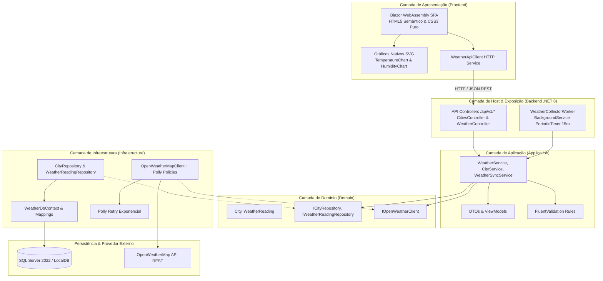
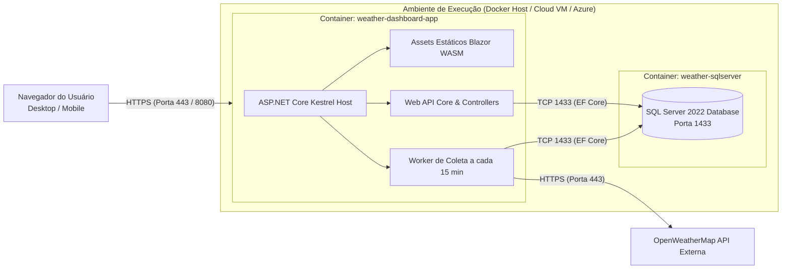

# Arquitetura do Sistema — Dashboard Climático das Capitais Brasileiras

## 1. Visão Geral

O sistema é construído seguindo rigorosamente os padrões de **Clean Architecture** e **SOLID**, garantindo o desacoplamento absoluto do domínio de negócio em relação a frameworks de banco de dados, provedores externos de previsão meteorológica e bibliotecas de interface gráfica.

---

## 2. Diagrama de Arquitetura Lógica

---

## 3. Diagrama de Arquitetura Física & Infraestrutura de Deploy

---

## 4. Modelagem do Banco de Dados

### 4.1 Entidade `Cities`
- `Id` (INT, PK, Identity): Identificador único da capital.
- `Name` (NVARCHAR(100), NOT NULL): Nome da capital (ex: Curitiba).
- `State` (NVARCHAR(2), NOT NULL): Sigla da UF (ex: PR).
- `Latitude` (FLOAT, NOT NULL): Latitude geográfica oficial do IBGE.
- `Longitude` (FLOAT, NOT NULL): Longitude geográfica oficial do IBGE.
- `OpenWeatherCityId` (NVARCHAR(50), NULL): ID opcional da cidade no provedor.
- *Índice Único:* `(Name, State)`.

### 4.2 Entidade `WeatherReadings`
- `Id` (BIGINT, PK, Identity): Identificador sequencial da leitura.
- `CityId` (INT, FK -> `Cities.Id`, NOT NULL): Referência à capital.
- `CollectedAtUtc` (DATETIME2, NOT NULL): Data/hora em UTC da coleta.
- `TemperatureC` (FLOAT, NOT NULL): Temperatura em graus Celsius.
- `FeelsLikeC` (FLOAT, NOT NULL): Sensação térmica em °C.
- `TempMinC` (FLOAT, NOT NULL): Temperatura mínima do instante.
- `TempMaxC` (FLOAT, NOT NULL): Temperatura máxima do instante.
- `Humidity` (INT, NOT NULL): Umidade relativa do ar (%).
- `PressureHpa` (FLOAT, NOT NULL): Pressão atmosférica em hPa.
- `WindSpeedMs` (FLOAT, NOT NULL): Velocidade do vento em m/s.
- `WeatherDescription` (NVARCHAR(150), NOT NULL): Descrição meteorológica oficial.
- `WeatherIcon` (NVARCHAR(20), NOT NULL): Código do ícone da condição.
- *Índice Composto de Alta Performance:* `(CityId, CollectedAtUtc)`.
