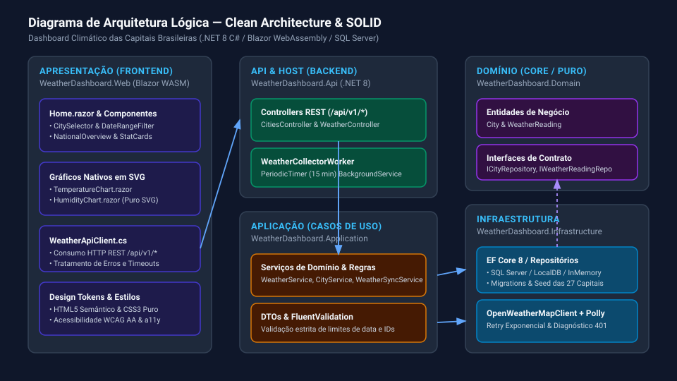
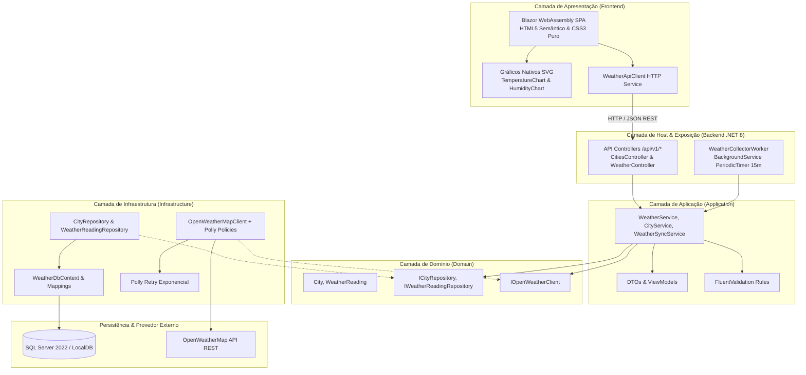
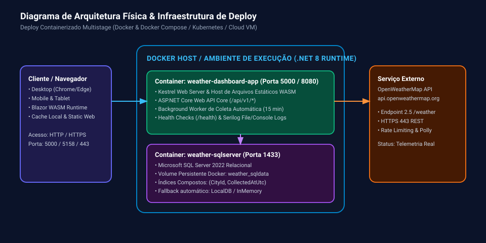
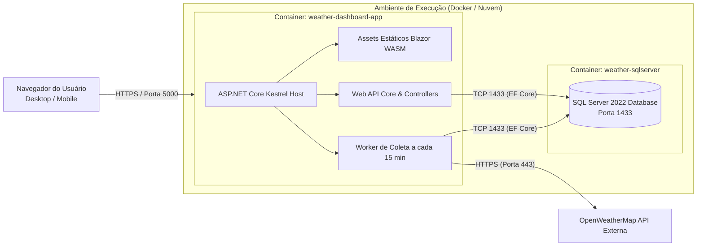

# Arquitetura Física e Lógica

Esta página detalha os diagramas de arquitetura, padrões de projeto e decisões de engenharia adotadas no sistema.

---

## 1. Diagrama de Arquitetura Lógica

---

## 2. Diagrama de Arquitetura Física & Deploy

---

## 3. Decisões de Design & Padrões

1. **Clean Architecture & Inversão de Dependências:** O núcleo de domínio (`Domain`) não possui referências a bancos de dados, frameworks ou bibliotecas de UI.
2. **Alta Performance em Consultas Históricas:** Índice composto `(CityId, CollectedAtUtc)` no banco SQL Server permite agregações e filtragens de datas em milissegundos.
3. **Resiliência e Isolamento por Cidade:** Falhas pontuais em uma capital não afetam a coleta nem a renderização das demais capitais.
